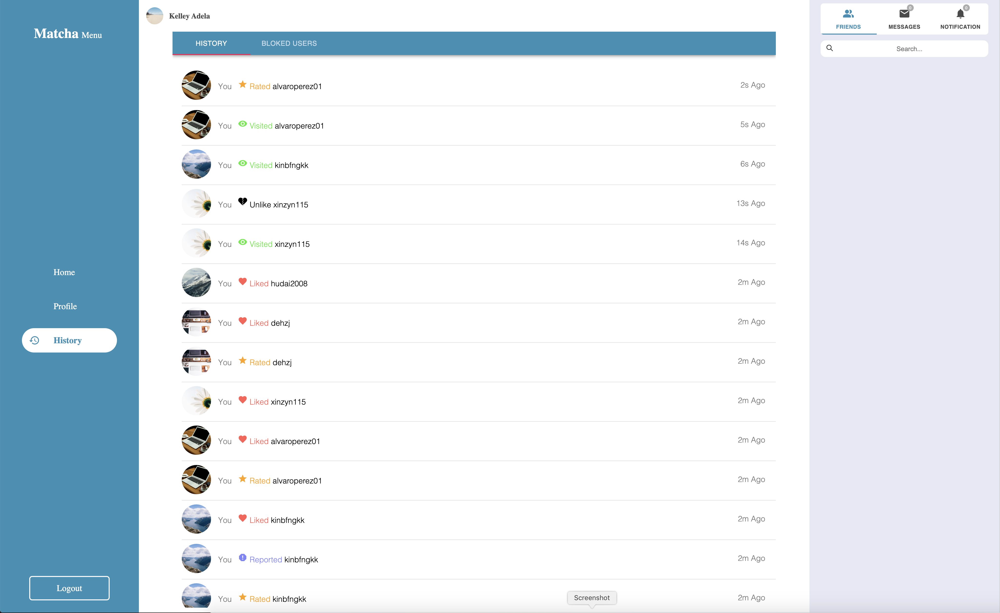

# Matcha  

A Dating website where a user, after creating an account and finishing his/her profile by adding:

-The gender

-The sexuality

-A biography

-A list of interest

-A profile picture

can search for other users and Like them.

If two Users Match (they both liked each other) they can start chating.

A user can also Block or Report fake accounts.

## Installation

install package for client and server

```bash
npm --prefix ./server install
npm --prefix ./client install
node ./server/Config/Setup.js #generate 580 users
```

How to run client-side

```bash
cd client
#production mode
npm run startDev #OR
#development mode
npm run startProduc
```

How to run server-side

```bash
cd server
npm run start
```

## Environment Variables

create .env file inside server folder and add the following variables

```env
PORT= <port>
HOST= <host>
PROTOCOL= <protocol>
CLIENT_PORT= <port>
CLIENT_HOST= <host>
CLIENT_PROTOCOL= <protocol>
MYSQL_HOST= <host>
MYSQL_PORT= <port>
MYSQL_USER= <user>
MYSQL_PASSWORD= <password>
MYSQL_DATABASE= <database>
opencagedata_API_KEY= <key>
NODEMAILER_EMAIL= <email>
NODEMAILER_PASS= <password>
JWT_KEY= <key>
```

## Screenshots

</br>
</br>
</br>
</br>
</br>
